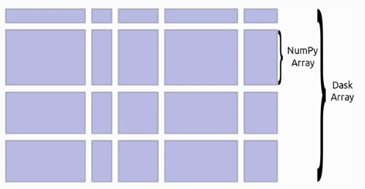
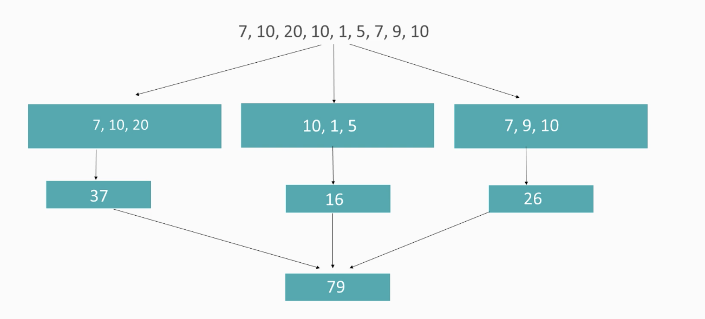

# Scalable Data Analysis in Python with DASK

This repo includes course and labs work related to [Dask](https://dask.org/)
The course is: [scalable-data-analysis-in-python-with-dask/](https://www.udemy.com/course/scalable-data-analysis-in-python-with-dask/)

The code will be in python 3.X

#### What is DASK
[Dask](https://dask.org/) is a library in Python, that allows users to:
- parallelize their existing code in python
- Scale out their existing code over clusters

It even has support for task scheduling and it can easily be used with libraries like NumPy, Pandas...
It offers a familiar API for parallel/distributed computing.

##### Use Cases for DASK:
- parallelize python code without major change
- load large datasets (bigger than size of RAM) and perform computation using specialized DASK structures like Dask arrays, Dask Dataframes,...
- scale out our code from single machine to large clusters
- support for task scheduling for complex applications

Notes: If your dataframe fits into memory very easily, then Pandas should be preferred over Dask

##### Features of DASK:
- allows parallelizing existing Python code w/o doing many changes
- has specialized data structures which allows users to load data larger than the size of memory (RAM) like:
 - Dask arrays
 - Dask Dataframes
 - Dask Bags
- has specialized blocked algorithms, which can perform different types of computations on chunks of datasets
- perform large computations with less memory footprint
- allows you to scale you code easily to a cluster of notes:
 - has provisions for handling nodes failures
 - can easily add notes on the fly
- Familiar Python API (similar to NumPy and Pandas) => minimum overhead to make our code compatible with DASK
- has provision for task-scheduling (similar to Apache AirFlow)e
- real-time responsive dashboard to view the status of jobs
- static profiler installed on each node for performance Analysis

##### Limitations of Dask
- In a distributed setting, the workers have the same limitations of Python processes.
- Assigning of tasks to workers may not always be optimal
- it makes the assumption that you data and functions are both serializable
- in case of failures, Dask may rerun your code multiple times
- any side effects based on your code, should be idempotent in nature (multiple identical requests/executions has the same effect as making a single request/execution)

##### Setting up DASK
To install locally using pip/conda:
`pip install dask`

To install all components of dask (like dask arrays), run:
`pip install dask[complete]`

You can then check running:
`python`
`import dask`

For Mac users, make sure to also install if not done already XCode Command Line (required for the complete install of Dask)
`xcode-select --install`

### 2. Understanding Dask arrays

**Dask arrays** are specialized data structures that can store chunks, or Numpy arrays
- interface is similar to NumPy API
- Blocked algorithms work on Dask arrays
- Dasks makes use of multiple cores to speedup computation on these arrays
- Allows out-of-memory computation (we can load arrays larger than our RAM, by breaking the data in small/manageable chunks)  

**Blocked Algorithms** are algorithms that work on chunks or blocks of data
- They break the computation into smaller manageable chunks, then move on to aggregating the results between these chunks
- Dask has specialized blocked algorithms to work with Dask Array, Dask Dataframes and so on

***Example***  
Assume we have an array and we want to sum that array.
We can break that array into chunks, sum each of them, then sum the sums.

##### Dask arrays
=> Check the following notebooks:
 - [dask array intro](notebooks/2-dask-arrays/intro-dask-arrays.ipynb)
 - [dask array deeper dive](notebooks/2-dask-arrays/digging-deeper-into-dask-arrays.ipynb)
 - [creating universal numpy functions with dask](notebooks/2-dask-arrays/universal-nympy-functions-with-dask.ipynb)

And to visualize graphs, please refer to [graphviz](https://docs.dask.org/en/latest/graphviz.html)

##### Parallelizing Python Code with Dask
 - [dask-delayed](notebooks/3-code-parallelism/dask-delayed.ipynb)
 
